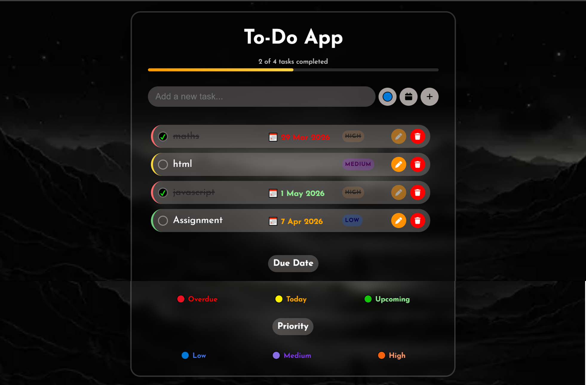

# 📝 Ultimate To-Do List Application

A beautifully designed, feature-rich Task Management application built entirely with vanilla Web Technologies. This project focuses on excellent user experience, modern UI/UX principles (such as Glassmorphism), and robust client-side state management.

## ✨ Features

- **Dynamic Task Management**: Add, edit, delete, and toggle tasks without page reloads.
- **Data Persistence**: Uses browser `localStorage` to securely store your data, ensuring your tasks are right where you left them when you return.
- **Smart Date Tracking**: Assign due dates! The app automatically evaluates dates in real-time, labeling them as 🔴 Overdue, 🟡 Due Today, or 🟢 Upcoming.
- **Priority Labeling**: Organize tasks visually by assigning dynamic 🔵 Low, 🟣 Medium, or 🟠 High priority indicators.
- **Visual Progress Bar**: Real-time progress tracking calculates completion percentages seamlessly as you mark goals off.
- **Gamified Rewards**: Complete all your pending tasks to trigger a rewarding confetti celebration animation! 🎊
- **Fully Responsive Design**: Custom CSS breakpoints guarantee the app looks stunning on any device, from a large monitor to a 320px mobile screen.

## 🛠️ Technology Stack

- **HTML5**: Clean, Semantic markup structure.
- **CSS3**: Complex styling using Flexbox, CSS Grid, Custom properties (variables), Keyframe animations, and Glassmorphism effects.
- **Vanilla JavaScript (ES6+)**: DOM manipulation, event-handling, local storage serialization/deserialization, and custom function logic.
- **External Libraries integrated**: `canvas-confetti` for gamification, `FontAwesome` for UI icons.

## 🚀 Quick Start / Run Locally

No complex setup or bundling required!

1. Clone or download this repository to your machine.
2. Navigate into the project folder.
3. Simply double-click the `todo-index.html` file to launch the application directly in your default web browser.

## 📸 Application Preview

---
*Created as a demonstration of modern Frontend Web Development concepts, Responsive UI Design, and Vanilla JavaScript proficiency.*
